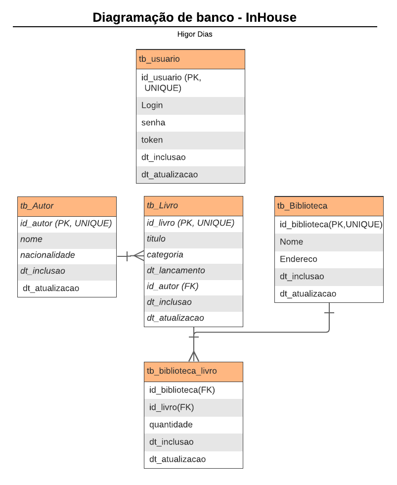

# Sistema de Gerenciamento de Biblioteca

## Visão Geral
Este projeto é um Sistema de Gerenciamento de Biblioteca desenvolvido com TypeScript, Sequelize, Express e Joi. Ele gerencia autores, livros, bibliotecas e usuários para autenticação. A aplicação utiliza Docker para containerização, facilitando a implantação e configuração.

## Esquema do Banco de Dados
O esquema do banco de dados é o seguinte:
- `tb_usuario`: Responsável pela autenticação dos usuários na aplicação (token).
- `tb_autor`: Armazena informações dos autores.
- `tb_livro`: Armazena informações dos livros.
- `tb_biblioteca`: Armazena informações das bibliotecas.
- `tb_biblioteca_livro`: Armazena a relação entre livros e bibliotecas, incluindo a quantidade de exemplares.


### Diagrama de Entidade-Relacionamento (MER)


## Requisitos
- Docker
- Docker Compose

## Configuração do Projeto

1. Clone o repositório:
    ```bash
    git clone https://github.com/HigorCaDias/biblioteca_management.git
    cd biblioteca_management
    ```

2. Crie a imagem Docker:
    ```bash
    docker build -t biblioteca-app .
    ```

3. Inicie os containers com Docker Compose:
    ```bash
    docker-compose up
    ```

4. A aplicação estará disponível em `http://localhost:3000`.

## Populando o Banco de Dados
A aplicação contém um script `validateModel` que popula todas as tabelas no momento da execução do projeto.

## Rotas Principais
As rotas seguem o padrão REST com prefixo `v1`:
- **/v1/autores**: Gerencia autores.
- **/v1/livros**: Gerencia livros.
- **/v1/bibliotecas**: Gerencia bibliotecas.
- **/v1/usuarios**: Gerencia usuários e autenticação.

## Autenticação
A autenticação é gerenciada pela tabela `tb_usuario`, que armazena login, senha e token.

- O padrão de autenticação utilizado é `Authorization: Bearer <token>`.
- O token é obtido através da rota `/v1/login`.
- Caso não queira criar um usuário, você pode utilizar as credenciais padrão:
  - **Login**: `admin`
  - **Senha**: `password123`

## Bibliotecas Utilizadas

1. **TypeScript**:
   - Superset do JavaScript que adiciona tipagem estática e outras funcionalidades.
   - Ajuda a identificar erros em tempo de desenvolvimento, melhorando a manutenção do código.

2. **Sequelize**:
   - ORM (Object-Relational Mapping) para Node.js.
   - Facilita a interação com o banco de dados, permitindo usar objetos JavaScript para realizar operações CRUD.

3. **Express**:
   - Framework minimalista para Node.js.
   - Utilizado para construir APIs e gerenciar rotas e middlewares.

4. **Joi**:
   - Biblioteca para validação de dados.
   - Garante que os dados recebidos na API estejam no formato esperado.

5. **Docker**:
   - Plataforma de containerização.
   - Permite empacotar a aplicação e suas dependências em um container, facilitando a distribuição e execução em qualquer ambiente.

6. **Docker Compose**:
   - Ferramenta para definir e gerenciar multi-containers Docker.
   - Simplifica a configuração e execução da aplicação e do banco de dados como um serviço unificado.

7. **nodemon**:
   - Ferramenta que ajuda a desenvolver aplicações baseadas em Node.js reiniciando automaticamente o servidor quando mudanças no código são detectadas.

8. **jsonwebtoken**:
   - Biblioteca para criação e verificação de tokens JWT (JSON Web Tokens).
   - Utilizada para autenticação e autorização de usuários na aplicação.

9. **bcryptjs**:
   - Biblioteca para hashing de senhas.
   - Utilizada para criptografar senhas de usuários antes de armazená-las no banco de dados.
